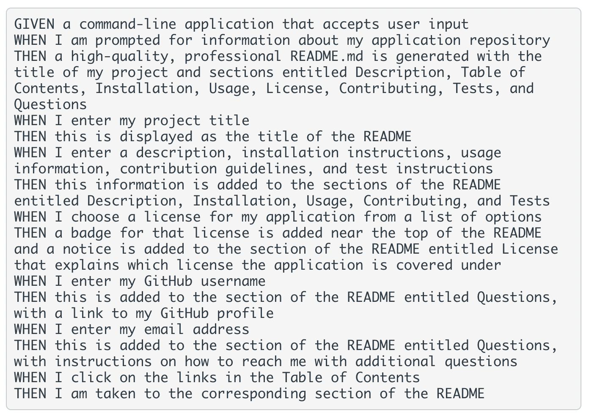

# Markdown Maker

  

  ## Description

  This project allows you to create a professional README file from the command line. The application will walk you through collecting the information needed and generate a completed file formatted and ready for use.

  ## Prompt
  

  ## Table of Contents

  * [Installation](#installation)
  * [Usage](#usage)
  * [Contributing](#contributing)
  * [Testing](#testing)
  * [License](#license)
  * [Questions](#questions)
  
  ## Installation

  Follow these steps for installing this project:

  1. Clone the repository. 2. Open the 'index.js' folder in your code editor of choice. 3. Open your CLI and navigate to the folder. 4. Enter 'node index' to begin.

  ## Usage

  Use this application when you need to create a README file while prioritizing your own applications or current projects.

  ## Contributing

  This project is not accepting contributions at this time.

  ## Testing

  Use the following for testing this project:

  Test as needed, based on your current setup.

  ## License

  This project is licensed with MIT License.

  ## Questions

  If you have questions about this project please contact me at [crawleyj2@gmail.com](mailto:crawleyj2@gmail.com).
  More of my work can be found on GitHub at [crawleyj2](https://github.com/crawleyj2)

